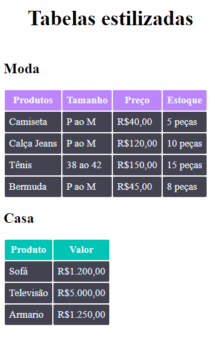

# Desafio básico de HTML e CSS 🧑‍💻

----

## 🔖 Descrição

    Exercício do módulo de HTML e CSS básico do curso DevQuest.
    O intuito desse desafio era construir duas tabelas estilizadas e
    aplicar os efeitos usando um arquivo separado de estilização 
    visando um código de fácil manutenção e com uma boa indentação
    

---

## 🚀 Tecnologias utilizadas

    - HTML
    - CSS

---

    Desenvolvido por Matheus Macedo
